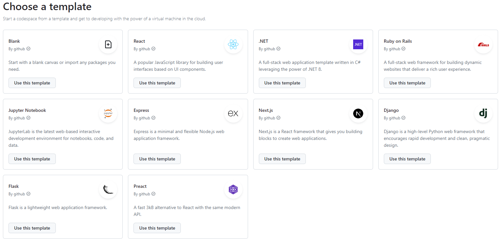
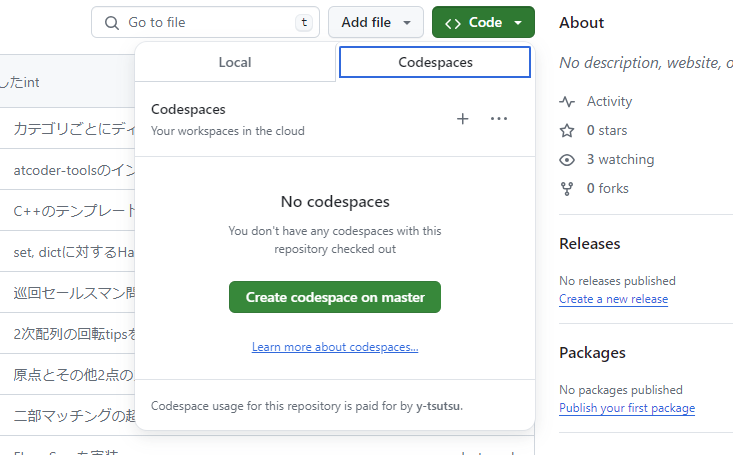
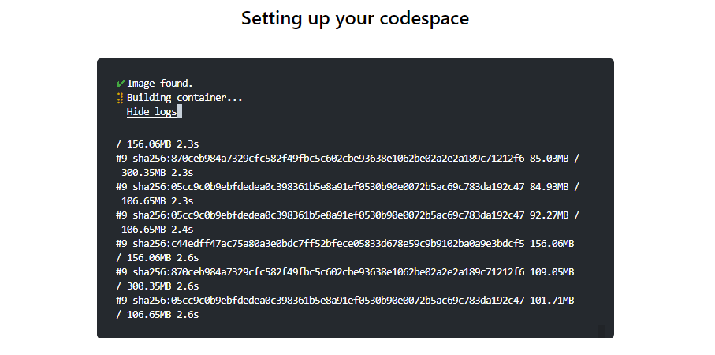

<!--
_class: lead invert
-->

# ブラウザでコーディング体験

---

<!--
_class: lead invert
-->

## いまだにローカルに開発環境を
## 構築しているんですか？

 
 

#### やばいですよそれ😨

---

<!--
_class: lead invert
-->

## 今はクラウド上で開発する時代です

---

<!--
_class: lead invert
-->

# GitHub Codespaces

 

### 超高速で構築するクラウド開発環境
[https://github.co.jp/features/codespaces](https://github.co.jp/features/codespaces)

---

<!--
_class: lead invert
-->

### ワンクリックで環境構築完了

---

<!--
_class: lead invert
-->

### ブラウザ上のVS Codeでコーディング・実行

---

<!--
_class: lead invert
-->

## リポジトリをCodespaceで開くことも

)

---

<!--
_class: lead invert
-->

## Dev Containersにも対応

明日の勉強会でも少し触れます

---

<!--
_class: lead invert
-->

## 料金プラン

[https://docs.github.com/ja/billing/managing-billing-for-github-codespaces/about-billing-for-github-codespaces](https://docs.github.com/ja/billing/managing-billing-for-github-codespaces/about-billing-for-github-codespaces)

* 一か月 120時間・15GBまでフリーで利用可能
* Pro版だと無料の利用枠が増えて，超えた分だけ課金
* 利用限度の設定をすることで爆死しないような契約のはず

---

<!--
_class: lead invert
-->

# Thank **You** for Reading 😃
